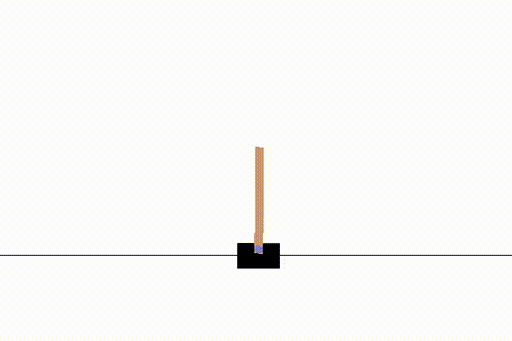
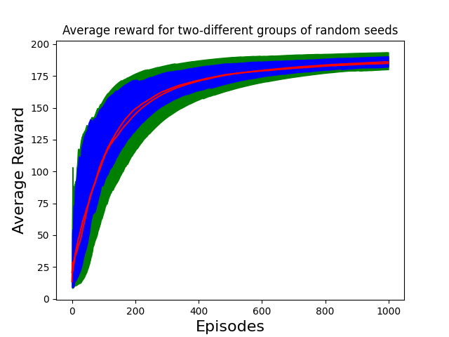
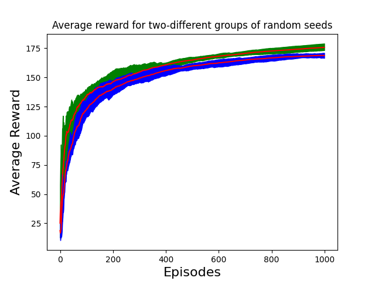

## Carpole-V0 Experiments

# Q-Learning

* [Wandb report](https://wandb.ai/tataganesh/RL-Learning-gym_experiments_cartpole-v0/reports/Analysis-of-Average-Reward-across-different-runs--VmlldzozNjgzODI) on the performance of the Q-Learning agent on 3 different step sizes across 10 different random seeds. The trials were divided into two groups of 5 random seeds for each step size. 

* Tests - 

   `pytest test_cartpole_simple.py::TestCartpoleDescreteQLearning` 


# Expected SARSA

* Running Expected SARSA tests - 

   `pytest test_cartpole_simple.py::TestCartpoleDescreteExpectedSarsa`


# Linear Function Approximation with Tile Coding

* Q-Learning

    

* SARSA

    


# Sweep Example

* Run sweep with config (TODO: Pass config as command-line argument)

   ` python3 sweep.py `
* Visualize results of a sweep

   ` python3 plotting.py --sweep_path=/home/tata/Learn/RL/RL-Learning/gym_experiments/cartpole-v0/sweeps/random_seed_sweep_qlearning_tilec `

   

   Sweep Configuration used to generate plot
   ```javascript
   {
	"params": {
		"step_size": [0.1],
		"epsilon": [0.1],
		"random_seed": [200, 300, 3257, 4333, 2366, 1458, 1385, 268, 2705, 1263, 26],
		"alpha_decay": [0.997],
		"epsilon_decay": [0.999],
		"num_episodes": [1000],
		"td_update_algo": ["qlearning"]
	   },
	"save_params": {
		"save_path": "sweeps",
		"name": "random_seed_sweep_qlearning_tilec"
	   },
	"tile_coding_params": {
		"low": [-3.4, -7, -1, -4],
		"high": [3.4, 7, 1, 4],
		"num_tilings": 16,
		"num_tiles": 8,
		"iht": 4096
	   }
   }
   ```

   
   Sweep Configuration used to generate plot
   ```javascript
   {
	"params": {
		"step_size": [1],
		"epsilon": [0.4],
		"random_seed": [200, 300, 3257, 4333, 2366, 1458, 1385, 268, 2705, 1263, 26],
		"alpha_decay": [0.997],
		"epsilon_decay": [0.999],
		"num_episodes": [1000],
		"td_update_algo": ["qlearning"]
	   },
	"save_params": {
		"save_path": "sweeps",
		"name": "random_seed_qlearning_tilec_high_eps"
	   },
	"tile_coding_params": {
		"low": [-3.4, -7, -1, -4],
		"high": [3.4, 7, 1, 4],
		"num_tilings": 16,
		"num_tiles": 8,
		"iht": 4096
	   }
   }
   ```
